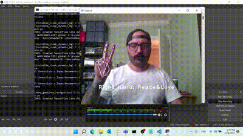
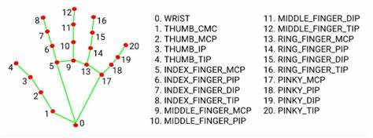

# Hand gestures detection

Hand gestures detection using mediapipe.
This project use mediapipe to detect hands in an image. Based on the hand landmarks positions specific gestures are detected.

**Mediapipe hand landmarks:**

## Requirements

+ opencv-contrib-python==4.5.5.64
+ opencv-python==4.5.5.62
+ opencv-python-headless==4.5.5.62
+ mediapipe==0.8.10
+ protobuf==3.19.3

## Installation or Getting Started

Download folder and open folder path in command prompt. Then create a virtual env:

    python3 -m venv hand_gestures_recognition

Activate virtual env

    hand_gestures_recognition\Scripts\activate

Install requirements

    pip install -r requirements.txt

Run code (press 'q' to quit):

    python main.py

To deactivate virtual env:

    deactivate

