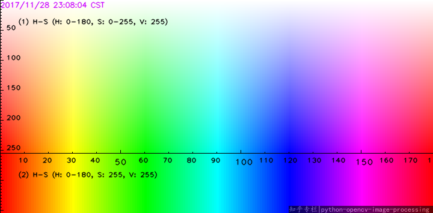

# Invisible cloak with dynamic background

Invisible cloak project based in color range.
This project works selecting a color range in HSV colorspace and overlaping two images. The first image corresponds to dynamic background image taken from mp4 file, and the second one corresponds to a webcam frame, then OpenCV is used to eliminate the portions where the color range is present in webcam frame.

**Important note**: First you need to create the mp4 file for the background.

**HSV colorspace:**

## Requirements

+ numpy==1.19.5
+ opencv-contrib-python==4.5.5.64
+ opencv-python==4.5.5.62
+ opencv-python-headless==4.5.5.62
+ mediapipe==0.8.10
+ protobuf==3.19.3

## Installation or Getting Started

Download folder and open folder path in command prompt. Then create a virtual env:

    python3 -m venv invisible_cloak_dynamic_bg

Activate virtual env

    invisible_cloak_dynamic_bg\Scripts\activate

Install requirements

    pip install -r requirements.txt

Run code (press 'q' to quit):

    python main.py

To deactivate virtual env:

    deactivate

