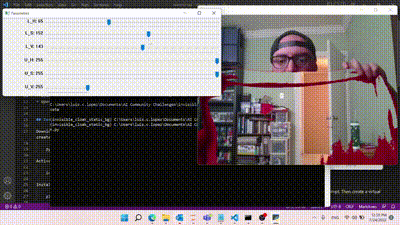

# Invisible cloak with static background

Invisible cloak project based in color range.
This project works selecting a color range in HSV colorspace and overlaping two images. The first image corresponds to static background image, and the second one corresponds to a webcam frame, then OpenCV is used to eliminate the portions where the color range is present in webcam frame.

**Important note**: You should run code when you are out of the webcam frame due background image is taken when code starts.

**HSV colorspace:**

## Requirements

+ numpy==1.19.5
+ opencv-contrib-python==4.5.5.64
+ opencv-python==4.5.5.62
+ opencv-python-headless==4.5.5.62

## Installation or Getting Started

Download folder and open folder path in command prompt. Then create a virtual env:

    python3 -m venv invisible_cloak_static_bg

Activate virtual env

    invisible_cloak_static_bg\Scripts\activate

Install requirements

    pip install -r requirements.txt

Run code (press 'q' to quit):

    python main.py

To deactivate virtual env:

    deactivate

