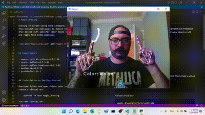
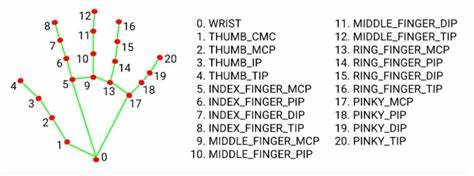

# Magic drawing

Drawing on screen using hand landmarks detection.
This project use mediapipe to detect hands in an image and draw points with specific color based on left hand gesture and right hand index position.

**Mediapipe hand landmarks:**

## Requirements

+ opencv-contrib-python==4.5.5.64
+ opencv-python==4.5.5.62
+ opencv-python-headless==4.5.5.62
+ mediapipe==0.8.10
+ protobuf==3.19.3

## Installation or Getting Started

Download folder and open folder path in command prompt. Then create a virtual env:

    python3 -m venv magic_drawing

Activate virtual env

    magic_drawing\Scripts\activate

Install requirements

    pip install -r requirements.txt

Run code (press 'q' to quit):

    python main.py

To deactivate virtual env:

    deactivate

